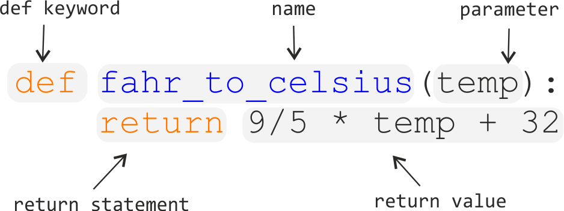

# Functions

## What is a function?

Function is a block of organized, reusable code that can make your code more effective, clearer to read and easier to handle. 
You can think functions as little self-contained programs that can perform a specific task which you can use repeatedly in your code. 
One of the basic principles in good programming is "not to repeat yourself", i.e. you shouldn't have
duplicate lines of code in your script. Functions are a way to avoid such situations and they can save you a lot of time and effort as you don't need to
retell the computer what to do every time it does a common task, such as converting temperatures from Fahrenheits to Celsius. 
During the course we have already used some functions such as `print()` command which is actually a built-in function in Python.

## Anatomy of a function

Let's consider the task from the first week when we converted temperatures from Fahrenheits to Celsius. Such an operation is a fairly common task 
when dealing with temperatures. Thus we might need to repeat such calculations quite frequently when analysing or comparing e.g. weather or 
climate changes between US and Europe.
   
Let's define our first function called ´fahr_to_celsius´:

  ```python
  def fahr_to_celsius(temp):
    return 9/5 * temp + 32
  ```
  


The function definition opens with the keyword def followed by the name of the function and a parenthesized list of parameter names. 
The body of the function — the statements that are executed when it runs — is indented below the definition line.

When we call the function, the values we pass to it are assigned to those variables so that we can use them inside the function. 
Inside the function, we use a return statement to send a result back to whoever asked for it.

Let’s try running our function. Calling our own function is no different from calling any other function:  

**TODO**

- Explain different parts of function
- Create a simple function
- Create a py-file with functions
- import those functions from the file and use them from another file.